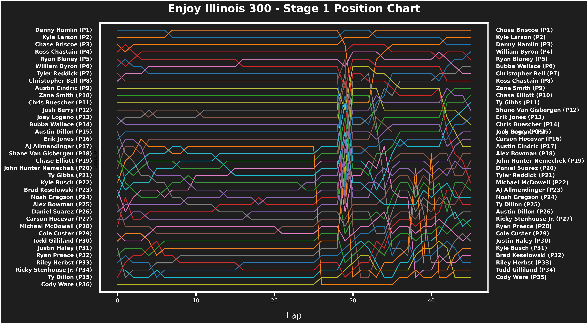
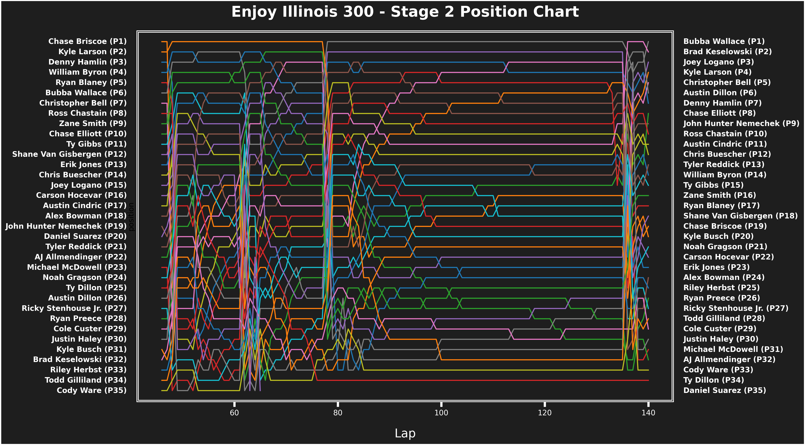
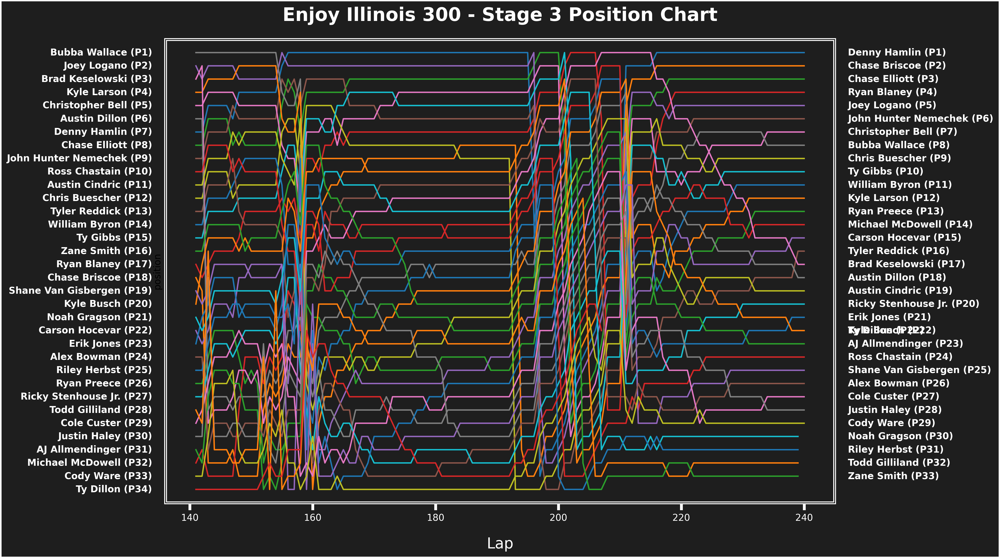
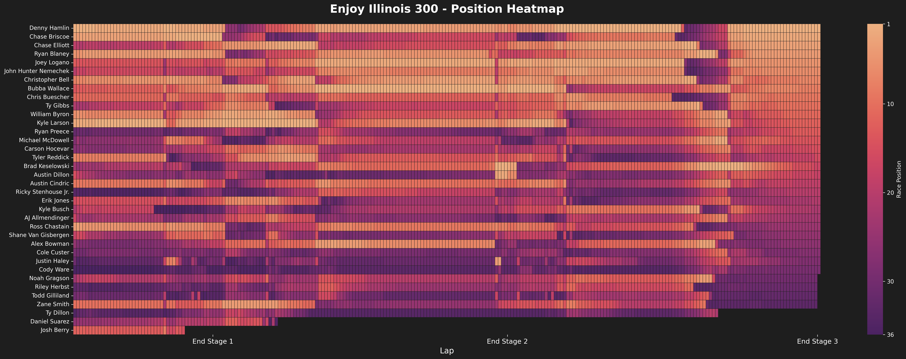

# NASCAR Race Analysis Example

```python
import warnings
import pandas as pd
import datetime
import os

from pynascar import Schedule, Race, set_options,get_settings
from pynascar.driver import DriversData

import seaborn as sns
import matplotlib.pyplot as plt
from matplotlib import patches as mpatches
from matplotlib import patheffects as pe
import numpy as np

set_options(cache_enabled=True, cache_dir=".cache/", df_format="parquet")

s = get_settings()
print("cache_dir:", s.cache_dir, "format:", s.df_format)
```

## Get the most recent schedule

```python
s25 = Schedule(2025,1)
r = s25.most_recent_race()
```

## Load the race data

```python
race_data = Race(2025,1,race_id=r['race_id'].values[0],reload=True)
laps = race_data.telemetry.lap_times
laps.loc[laps['driver_name']=='Shane Van Gisbergen #','driver_name'] = 'Shane Van Gisbergen'
pits = race_data.telemetry.pit_stops
pits.loc[pits['driver_name']=='Shane Van Gisbergen #','driver_name'] = 'Shane Van Gisbergen'
cautions = race_data.results.cautions
laps.sample(5)
```

## Driver Performance Over Laps

```python
def drivers_plot(data, x, y, background_color = '#1e1e1e', text_color = '#ffffff', y_label = '', size = (16, 9)):

    background_color = '#1e1e1e'
    text_color = '#ffffff'
    y_label = 'Lap Speed (mph)'
    title = f'{race_data.metadata.name} - Lap Speed'

    fig, ax = plt.subplots(figsize=size)

    # Style
    fig.patch.set_linewidth(3)
    fig.patch.set_edgecolor('white')
    fig.patch.set_facecolor(background_color)
    ax.patch.set_linewidth(3)
    ax.patch.set_edgecolor('white')
    ax.set_facecolor(background_color)
    ax.set_ylabel(y_label, fontsize=16, fontweight='bold', color=text_color, labelpad=15)
    ax.set_xlabel('', fontsize=16, color=text_color, labelpad=15)
    ax.set_title(title, fontsize=20, fontweight='bold', color='white', pad=20)

    for driver in data['driver_name'].unique():
        driver_laps = data[data['driver_name'] == driver]
        sns.lineplot(data=driver_laps, x=x, y=y, label=driver)

    ax.legend(ncol=2,loc='center left', bbox_to_anchor=(1.01, 0.5), title='Driver')
    ax.tick_params(axis='x', colors=text_color, length=8, width=3)
    ax.tick_params(axis='y', colors=text_color, length=8, width=3)
    ax.set_yticklabels(ax.get_yticks(), fontsize=14, color=text_color, fontweight='bold')

drivers_plot(laps, x='Lap', y='lap_speed')
```

## Position Charts by Stage

```python
def drivers_position_plot(data, x, y, title, background_color = '#1e1e1e', text_color = '#ffffff',
                           y_label = '', size = (16, 9),save:bool=False):

    background_color = '#1e1e1e'
    text_color = '#ffffff'
    y_label = 'Lap Speed (mph)'

    fig, ax = plt.subplots(figsize=size)

    # Style
    fig.patch.set_linewidth(3)
    fig.patch.set_edgecolor('white')
    fig.patch.set_facecolor(background_color)
    ax.patch.set_linewidth(3)
    ax.patch.set_edgecolor('white')
    ax.set_facecolor(background_color)
    ax.set_xlabel('', fontsize=16, color=text_color, labelpad=15)
    ax.set_title(title, fontsize=20, fontweight='bold', color='white', pad=20)

    for driver in data['driver_name'].unique():
        driver_laps = data[data['driver_name'] == driver]
        
        line = sns.lineplot(data=driver_laps, x=x, y=y, label=driver)
        
        # Get starting and final positions
        starting_position = driver_laps[y].iloc[0]
        final_position = driver_laps[y].iloc[-1]
        
        # Add starting position label on the left (outside plot area)
        ax.text(-0.02, starting_position, f'{driver} (P{int(starting_position)})', 
                transform=ax.get_yaxis_transform(), ha='right', va='center',
                fontsize=10, color=text_color, fontweight='bold')
        
        # Add finishing position label on the right (outside plot area)
        ax.text(1.02, final_position, f'{driver} (P{int(final_position)})', 
                transform=ax.get_yaxis_transform(), ha='left', va='center',
                fontsize=10, color=text_color, fontweight='bold')

    # Remove legend since we're using text labels
    ax.get_legend().remove()
    
    # Remove y-axis ticks and labels
    ax.set_yticks([])
    ax.set_yticklabels([])
    
    ax.tick_params(axis='x', colors=text_color, length=8, width=3)
    ax.tick_params(axis='y', colors=text_color, length=8, width=3)
    ax.set_ylim(0,len(data['position'].unique())+1)
    ax.yaxis.set_inverted(True)
    
    # Adjust layout to make room for labels
    plt.subplots_adjust(left=0.25, right=0.75)

    dir = f'plots/{race_data.metadata.name}'
    if save:
        if not os.path.exists(dir):
            os.makedirs(dir)
        plt.savefig(f'{dir}/{title.replace(" ", "_")}_{datetime.datetime.now().strftime("%Y%m%d_%H%M%S")}.png', dpi=300, bbox_inches='tight')

# Create stage data
stage1 = laps[laps['Lap'] <= race_data.metadata.stage_1_laps]
stage2 = laps[(laps['Lap'] > race_data.metadata.stage_1_laps) & (laps['Lap'] <= race_data.metadata.stage_2_laps + race_data.metadata.stage_1_laps)]
stage3 = laps[(laps['Lap'] > race_data.metadata.stage_2_laps + race_data.metadata.stage_1_laps)]

drivers_position_plot(stage1, x='Lap', y='position',title = f'{race_data.metadata.name} - Stage 1 Position Chart',size=(20, 9),save=True)
drivers_position_plot(stage2, x='Lap', y='position',title = f'{race_data.metadata.name} - Stage 2 Position Chart',size=(20, 9),save=True)
drivers_position_plot(stage3, x='Lap', y='position',title = f'{race_data.metadata.name} - Stage 3 Position Chart',size=(20, 9),save=True)
```






## Driver Long Run Analysis

```python
def get_driver_runs(data, min_laps=15, min_speed=130):
    """
    Get runs of consecutive laps for each driver where speed > min_speed
    and the run is at least min_laps long
    """
    runs_data = []
    
    for driver in data['driver_name'].unique():
        driver_laps = data[data['driver_name'] == driver].copy()
        driver_laps = driver_laps.sort_values('Lap')
        
        # Create boolean mask for laps above speed threshold
        above_speed = driver_laps['lap_speed'] > min_speed
        
        # Find consecutive groups
        groups = []
        current_group = []
        
        for idx, (lap_idx, is_above) in enumerate(zip(driver_laps.index, above_speed)):
            if is_above:
                current_group.append(lap_idx)
            else:
                if len(current_group) >= min_laps:
                    groups.append(current_group)
                current_group = []
        
        # Don't forget the last group
        if len(current_group) >= min_laps:
            groups.append(current_group)
        
        # Add qualifying runs to results
        for run_num, group in enumerate(groups, 1):
            run_data = driver_laps.loc[group].copy()
            run_data['run_number'] = run_num
            run_data['run_length'] = len(group)
            run_data['avg_speed'] = run_data['lap_speed'].mean()
            runs_data.append(run_data)
    
    if runs_data:
        return pd.concat(runs_data, ignore_index=True)
    else:
        return pd.DataFrame()

def summarize_runs(runs_data):
    """
    Create a summary DataFrame with one row per run containing
    average, best, and worst statistics for speed and position
    """
    if runs_data.empty:
        return pd.DataFrame()
    
    summary_data = []
    
    # Group by driver and run_number to get individual runs
    for (driver, run_num), run_group in runs_data.groupby(['driver_name', 'run_number']):
        summary = {
            'driver_name': driver,
            'run_number': run_num,
            'run_length': run_group['run_length'].iloc[0],
            'start_lap': run_group['Lap'].min(),
            'end_lap': run_group['Lap'].max(),
            
            # Speed statistics
            'avg_speed': run_group['lap_speed'].mean(),
            'median_speed': run_group['lap_speed'].median(),
            'best_speed': run_group['lap_speed'].max(),
            'worst_speed': run_group['lap_speed'].min(),
            
            # Position statistics
            'starting_position': run_group['position'].iloc[0],
            'finishing_position': run_group['position'].iloc[-1],
            'best_position': run_group['position'].min(),
            'worst_position': run_group['position'].max(),
            'avg_position': run_group['position'].mean()
        }
        summary_data.append(summary)
    
    summary = pd.DataFrame(summary_data)
    summary['speed_falloff'] = (summary['best_speed'] - summary['worst_speed'])/summary['run_length']
    summary['positions_diff'] = summary['starting_position'] - summary['finishing_position']
    return summary

# Get the runs
running_speed = laps.lap_speed.quantile(0.25)
average_run = get_driver_runs(laps, min_laps=15, min_speed=running_speed)

# Create the summary
run_summary = summarize_runs(average_run)
driver_ranks = run_summary.groupby('driver_name').agg('mean')
driver_ranks.sort_values('avg_speed', ascending=False, inplace=True)
driver_ranks['team'] = driver_ranks.index.map(race_data.results.results.set_index('driver_name')['team'])
driver_ranks.head()
```

## Team Colors and Visualization Setup

```python
# Team color mapping
average_run['team'] = average_run['driver_name'].map(race_data.results.results.set_index('driver_name')['team'])
team_colors = {
    'Richard Childress Racing': '#FF1744',
    'Joe Gibbs Racing': '#1E90FF',
    'RFK Racing': '#FF8C00',
    'Kaulig Racing': '#2E8B57',
    'Spire Motorsports': '#FFD700',
    'Team Penske': '#651FFF', 
    'HYAK Motorsports': '#8A2BE2',
    'Trackhouse Racing': '#FF69B4',
    '23XI Racing': '#FF6D00',
    'Hendrick Motorsports': '#1DE9B6',
    'Legacy Motor Club': '#DA70D6',
    'Haas Factory Team': '#708090',
    'Wood Brothers Racing': '#A0522D',
    'Rick Ware Racing': '#7FFF00',
    'Front Row Motorsports': '#9ACD32',
    'NY Racing Team': "#00CED1",
    'Garage 66': "#FF00FF"
}

colors = sns.color_palette('bright', len(average_run['team'].unique()))
palette = dict(zip(average_run['team'].unique(), colors))
drivers_palette = {driver: palette[team] for driver, team in zip(average_run['driver_name'], average_run['team'])}
```

## Box Plot Analysis

```python
def drivers_box_plot(data, x, y, title='', background_color = '#1e1e1e', text_color = '#ffffff',
                      y_label = '', median=True,driver=True, manufacturer=False, size = (16, 12),save=False):
    fig,ax = plt.subplots(figsize=size)
    
    # Get finishing positions for each driver to sort by
    driver_finish_positions = driver_ranks.groupby('driver_name')['median_speed'].last().sort_values(ascending=False)
    sorted_drivers = driver_finish_positions.index.tolist()
    
    # Style
    fig.patch.set_linewidth(3)
    fig.patch.set_edgecolor('white')
    fig.patch.set_facecolor(background_color)
    ax.patch.set_linewidth(3)
    ax.patch.set_edgecolor('white')
    ax.set_facecolor(background_color)
    ax.tick_params(axis='x', colors=text_color, length=8, width=3)
    ax.tick_params(axis='y', colors=text_color, length=8, width=3)
    ax.set_xlabel(y_label, fontsize=16, fontweight='bold', color=text_color, labelpad=15)
    ax.set_ylabel('', fontsize=16, color=text_color, labelpad=15)
    ax.set_title(title, fontsize=20, fontweight='bold', color='white', pad=20)
    
    if median:
        overall_median = data[x].median()
        median_line = ax.axvline(x=overall_median, color='white', linewidth=1, linestyle='--', alpha=0.8)

    # Create boxplot with ordered drivers
    if driver:
        sns.boxplot(data=data, x=x, y=y, order=sorted_drivers, hue='team', showfliers=False,
                    linewidth=1.5, linecolor='white', ax=ax,palette=team_colors,)
    elif manufacturer:
        sns.boxplot(data=data, x=x, y=y, hue='manufacturer', showfliers=False,
                    linewidth=1.5, linecolor='white', ax=ax)
    else:
        sns.boxplot(data=data, x=x, y=y, hue='team', showfliers=False,
                    linewidth=1.5, linecolor='white', ax=ax,palette=team_colors,)
    
    ax.tick_params(axis='x', colors=text_color, length=8, width=3)
    ax.tick_params(axis='y', colors=text_color, length=8, width=3)
    ax.set_ylabel('', fontsize=16, color=text_color, labelpad=15)
    ax.set_xlabel(y_label, fontsize=16, fontweight='bold', color=text_color, labelpad=15)

    if driver:
        ax.set_yticklabels(sorted_drivers, fontsize=14, fontweight='bold', color=text_color)
    else:
        ax.set_yticklabels(data[y].unique(), fontsize=14, fontweight='bold', color=text_color)
    ax.set_xticklabels(ax.get_xticks(), fontsize=14, fontweight='bold', color=text_color)

    handles, labels = ax.get_legend_handles_labels()
    # Add median line to legend
    if median:
        handles.append(median_line)
        labels.append(f'Median Speed ({overall_median:.1f} mph)')

    # Create new legend with all items
    ax.legend(handles=handles, labels=labels, loc='center left', bbox_to_anchor=(1.05, 0.5), title='Team', fontsize=12)
    plt.tight_layout()

    dir = f'plots/{race_data.metadata.name}'
    if save:
        if not os.path.exists(dir):
            os.makedirs(dir)
        plt.savefig(f'{dir}/{title.replace(" ", "_")}_{datetime.datetime.now().strftime("%Y%m%d_%H%M%S")}.png', dpi=300, bbox_inches='tight')

# Generate box plots
average_run['manufacturer'] = average_run['driver_name'].map(race_data.results.results.set_index('driver_name')['manufacturer'])
drivers_box_plot(average_run, x='avg_speed', y='driver_name', title=f'{race_data.metadata.name} — Average Speed',y_label='Speed (mph)',save=True)
drivers_box_plot(average_run, x='position', y='driver_name', title=f'{race_data.metadata.name} — Starting Position',
                 y_label='Starting Position',median=False,save=True)

drivers_box_plot(average_run, x='avg_speed', y='manufacturer', title=f'{race_data.metadata.name} — Average Speed by Manufacturer Teams',y_label='Speed (mph)',driver=False,save=True)
drivers_box_plot(average_run, x='avg_speed', y='manufacturer', title=f'{race_data.metadata.name} — Average Speed by Manufacturer',y_label='Speed (mph)',driver=False, manufacturer=True,save=True)
```

## Pit Stop Analysis

```python
# Pit stop analysis
pit_stops = pits[(pits['lap']>0) & (pits['lap'] < pits.lap.max()-2) & (pits['pit_stop_duration'] > 0)]
pit_stops['team'] = pits['driver_name'].map(race_data.results.results.set_index('driver_name')['team'])
drivers_box_plot(pit_stops, x='total_duration', y='driver_name', title=f'{race_data.metadata.name} — Pit Stop Duration', y_label='Pit Stop Duration (seconds)')

# Aggregate pit stop statistics
pit_stops_agg = pit_stops.groupby('driver_name').agg(
    total_pit_stops = ('pit_stop_duration','count'),
    avg_pit_stop_duration = ('pit_stop_duration','mean'),
    min_pit_stop_duration = ('pit_stop_duration','min'),
    max_pit_stop_duration = ('pit_stop_duration','max')
).reset_index()
pit_stops_agg['team'] = pit_stops_agg['driver_name'].map(race_data.results.results.set_index('driver_name')['team'])
```

## Horizontal Bar Charts

```python
def create_track_figure_horiz(results,x = 'avg_speed_rank',y='driver_name', title='', y_label='Average Lap Speed Rank \n (lower = better)',
                               text_color='white', background_color='#41444a', size=(16, 9), save=False):

    # Sort drivers by average speed rank
    results = results.sort_values(by=x, ascending=True).reset_index(drop=True)

    fig, ax = plt.subplots(figsize=size)
    sns.barplot(
        data=results,
        y='driver_name',
        x=x,
        hue='team',
        palette=team_colors,
        errorbar=None,
        ax=ax,
        order=results['driver_name'].tolist()  # lock category positions to results order
    )

    # Style
    fig.patch.set_linewidth(3)
    fig.patch.set_edgecolor('white')
    fig.patch.set_facecolor(background_color)
    ax.patch.set_linewidth(3)
    ax.patch.set_edgecolor('white')
    ax.set_facecolor(background_color)
    ax.tick_params(axis='x', colors=text_color, length=8, width=3)
    ax.tick_params(axis='y', colors=text_color, length=8, width=3)
    ax.set_xticklabels(ax.get_xticks(), fontsize=14, color=text_color, fontweight='bold')
    ax.set_xlabel(y_label, fontsize=16, fontweight='bold', color=text_color, labelpad=15)
    ax.set_ylabel('', fontsize=16, color=text_color, labelpad=15)
    ax.set_title(title, fontsize=20, fontweight='bold', color='white', pad=20)

    # Set y-axis labels (driver names) - no rotation needed for horizontal bars
    y_positions = range(len(results))
    ax.set_yticks(y_positions)
    ax.set_yticklabels(results['driver_name'], fontsize=14, fontweight='bold', color=text_color)
    ax.legend(loc='center left', bbox_to_anchor=(1.05, 0.5), title='Team')
    plt.tight_layout()
    
    dir = f'plots/{race_data.metadata.name}'
    if save:
        if not os.path.exists(dir):
            os.makedirs(dir)
        plt.savefig(f'{dir}/{title.replace(" ", "_")}_{datetime.datetime.now().strftime("%Y%m%d_%H%M%S")}.png', dpi=300, bbox_inches='tight')

# Generate charts
create_track_figure_horiz(pit_stops_agg, x='avg_pit_stop_duration', title=f'{race_data.metadata.name} — Average Pit Stop Duration', y_label='Pit Stop Duration (seconds)',save=True)

drivers=race_data.driver_data.drivers
drivers['team'] = drivers['driver_name'].map(race_data.results.results.set_index('driver_name')['team'])
create_track_figure_horiz(drivers, x='passing_diff', title=f'{race_data.metadata.name} — Green Flag Passing Difference', y_label='Passes',save=True)
create_track_figure_horiz(drivers, x='fast_laps', title=f'{race_data.metadata.name} — Fastest Laps set', y_label='Fastest Laps',save=True)
```

## Position Heatmap

```python
def drivers_position_heatmap(data, x='Lap', y='position', background_color='#1e1e1e', 
                             text_color='#ffffff', size=(20, 9),save=False):
    """
    Heatmap of driver positions over laps.
    Rows = drivers, Columns = laps, Values = positions.
    """
    # Get finishing positions for each driver to sort by
    driver_finish_positions = race_data.results.results.set_index('driver_name')['finishing_position']
    sorted_drivers = driver_finish_positions.index.tolist()
    
    # Build pivot table: rows=drivers, columns=laps, values=position
    heatmap_data = data.pivot(index='driver_name', columns=x, values=y)
    
    # Reorder the rows according to finishing position
    heatmap_data = heatmap_data.reindex(sorted_drivers)

    # Set up plot
    fig, ax = plt.subplots(figsize=size)
    fig.patch.set_facecolor(background_color)
    ax.set_facecolor(background_color)

    # Draw heatmap
    sns.heatmap(
        heatmap_data,
        cmap="flare",
        cbar_kws={'label': 'Race Position', 'ticks': [1,10,20,30,race_data.results.results['finishing_position'].max()]},
        linewidths=0.1,
        linecolor=background_color,
        ax=ax
    )

    # Style
    ax.set_title(f"{race_data.metadata.name} - Position Heatmap", fontsize=20, fontweight='bold', color=text_color, pad=20)
    ax.set_xlabel("Lap", fontsize=14, color=text_color)
    ax.set_ylabel("", fontsize=14, color=text_color)

    stage_ticks = {'End Stage 1': race_data.metadata.stage_1_laps,
                   'End Stage 2': race_data.metadata.stage_1_laps + race_data.metadata.stage_2_laps,
                   'End Stage 3': race_data.metadata.stage_1_laps + race_data.metadata.stage_2_laps + race_data.metadata.stage_3_laps}

    ax.set_xticks(list(stage_ticks.values()))
    ax.set_xticklabels(list(stage_ticks.keys()), color=text_color, fontsize=12)

    # Make tick labels readable
    ax.tick_params(axis='x', colors=text_color, rotation=0)
    ax.tick_params(axis='y', colors=text_color)

    # Colorbar text
    cbar = ax.collections[0].colorbar
    cbar.ax.yaxis.label.set_color(text_color)
    cbar.ax.tick_params(colors=text_color)
    cbar.ax.invert_yaxis()

    plt.tight_layout()
    dir = f'plots/{race_data.metadata.name}'
    if save:
        if not os.path.exists(dir):
            os.makedirs(dir)
        plt.savefig(f'{dir}/Position_Heatmap_{datetime.datetime.now().strftime("%Y%m%d_%H%M%S")}.png', dpi=300, bbox_inches='tight')
    plt.show()

# Generate heatmap
drivers_position_heatmap(laps, x='Lap', y='position', size=(25, 9),save=True)
```

